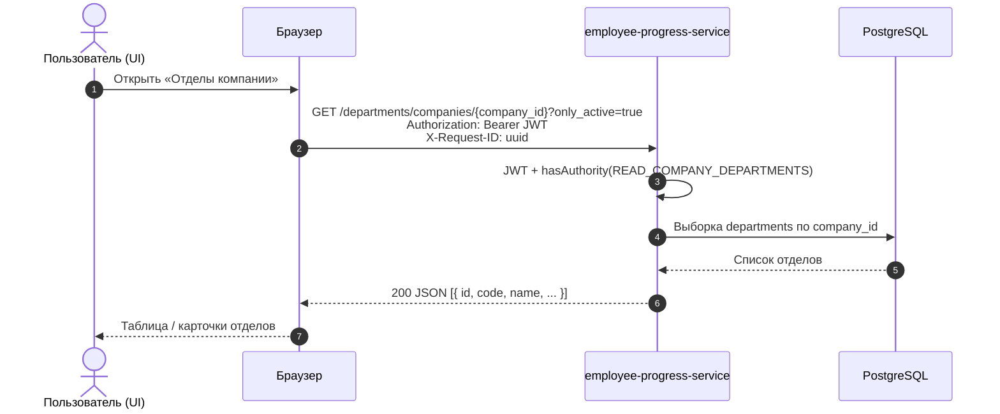
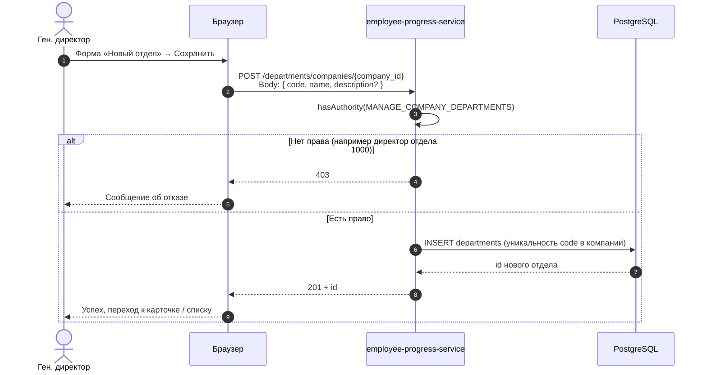
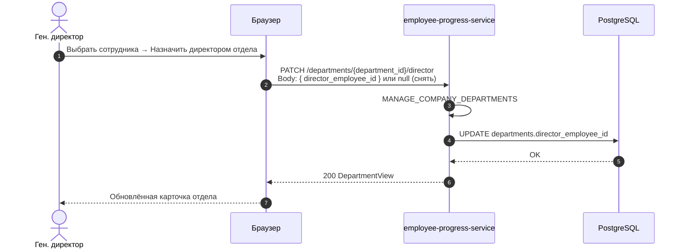
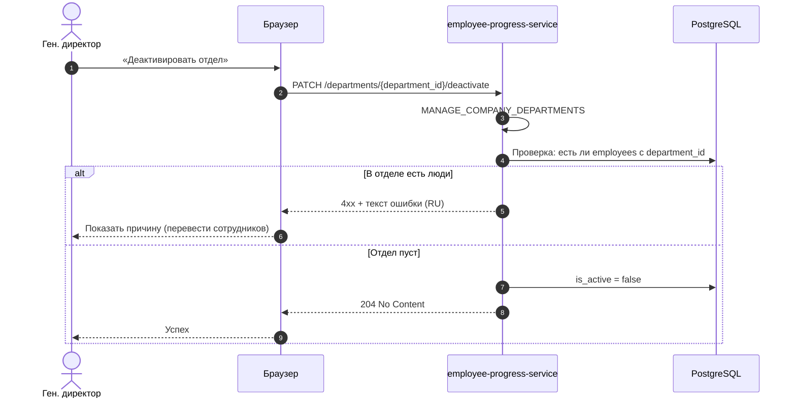
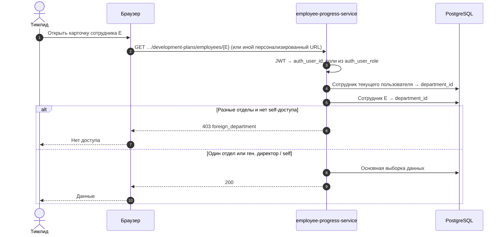

# Sequence-диаграммы: отделы и сотрудники

Контекст API: базовый URL `http://localhost:8008/employee-progress` (префикс `/employee-progress` обязателен). JSON в **snake_case**. Аутентификация: Bearer JWT.

Источник: `DepartmentController`, `CompanyEmployeesController`, `EmployeeDepartmentManagementService`, `EmployeeSelfAccessPolicy`, миграции `V40__departments_and_employee_department_fk.sql`, `V41__oauth_grants_departments.sql`.

---

## 1. Просмотр списка отделов компании

Чтение: `READ_COMPANY_DEPARTMENTS` — выдано ролям **1000–1003** (все).



---

## 2. Создание отдела (только генеральный директор)

Запись: `MANAGE_COMPANY_DEPARTMENTS` — только роль **1001** (Генеральный директор).



---

## 3. Назначение директора отдела



---

## 4. Деактивация отдела

Инвариант: нельзя деактивировать, если в отделе **есть сотрудники** (проверка в сервисе).



---

## 5. Создание сотрудника с привязкой к отделу (+ Kafka)

Обязательное поле `department_id` в теле. Право: `MANAGE_COMPANY_EMPLOYEES` (роли **1000, 1001** по прежней матрице).

```mermaid
sequenceDiagram
    autonumber
    actor HR as Дирекция (UI)
    participant B as Браузер
    participant API as employee-progress-service
    participant DB as PostgreSQL
    participant K as Kafka
    participant US as users-service (асинхронно)

    HR->>B: Форма нового сотрудника (email, отдел, грейд, роль…)
    B->>API: POST /companies/{company_id}/employees<br/>Body вкл. department_id, grade_id, auth_role_id, …
    API->>API: MANAGE_COMPANY_EMPLOYEES + валидация отдела той же компании
    API->>DB: INSERT employees (department_id NOT NULL)
    API->>K: Событие регистрации пользователя (см. описание контроллера)
    Note over K,US: Связка auth_user_id и роли в users-service после ответного сообщения
    API-->>B: 201 + employee id
    B-->>HR: Успех; отдельно UI может опросить статус учётной записи
```

---

## 6. Перевод сотрудника в другой отдел

Если сотрудник был **директором** предыдущего отдела, у того отдела директор **снимается** (инвариант «директор — член отдела»).

```mermaid
sequenceDiagram
    autonumber
    actor HR as Дирекция (UI)
    participant B as Браузер
    participant API as employee-progress-service
    participant DB as PostgreSQL

    HR->>B: Сменить отдел у сотрудника
    B->>API: PATCH /companies/employees/{employee_id}/department<br/>Body: { department_id }
    API->>API: MANAGE_COMPANY_EMPLOYEES
    API->>DB: Проверка: новый отдел той же компании и активен
    API->>DB: UPDATE employees.department_id; при необходимости снять director с старого отдела
    DB-->>API: OK
    API-->>B: 200 + id
    B-->>HR: Обновлённый профиль
```

---

## 7. Доступ к данным сотрудника (контекст отдела)

Логика `EmployeeSelfAccessPolicy`: **1001** — без ограничения по отделам; **1000 / 1002** — только сотрудники **того же** `department_id`, что и текущий пользователь; **1003** — только себя.



---

## Связанные документы

- `docs/ui-roles.md` — зоны UI (при необходимости добавить зону «Отделы»).
- `D:\javaprojects\employee-progress\employee-progress-service\docs\` — OpenAPI после сборки backend.
