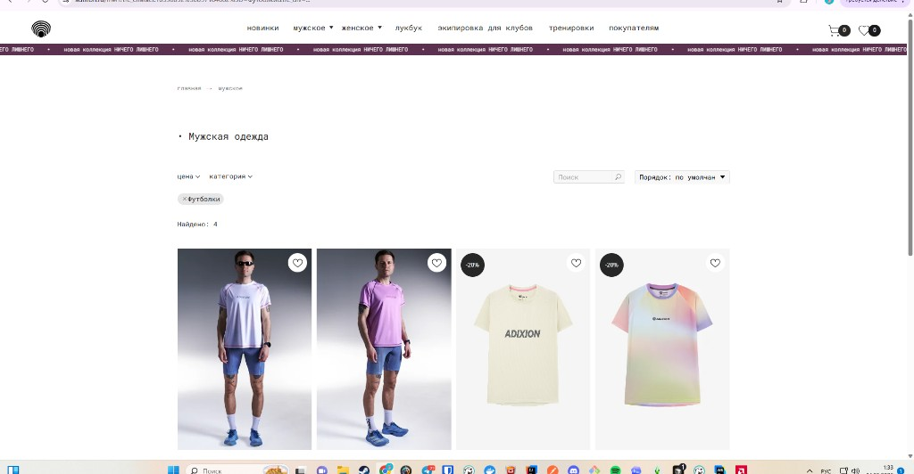
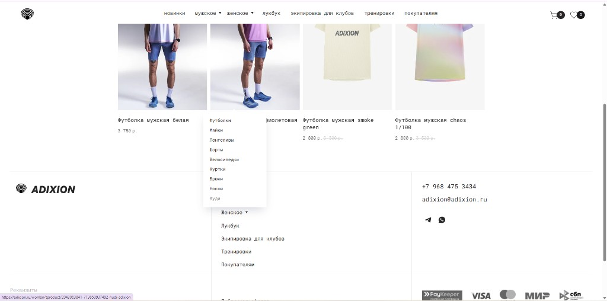

# Референс стиля UI/UX

Источник: скриншоты витрины **ADIXION** (минималистичный e‑commerce). Для карьерного портала переносим **принципы** (сетка, воздух, типографика, панель фильтров), а не товарный контент.

Файлы в репозитории:

| Файл | Содержание кадра |
|------|------------------|
| [reference-category-page.png](./ui-screenshots/reference-category-page.png) | Категория: хлебные крошки, заголовок, полоса объявлений, фильтры + поиск + сортировка, сетка карточек |
| [reference-home-grid-footer.png](./ui-screenshots/reference-home-grid-footer.png) | Сетка карточек, выпадающее меню навигации, футер с колонками и платёжными иконками |





---

## Общий характер

- **Минимализм:** много белого фона, без тяжёлых рамок у карточек, контент важнее декора.
- **Плоский UI:** слабые или нулевые тени, без глянца и градиентов на панелях (кроме узкой акцентной полосы, если решим её повторить).
- **Сетка:** чёткая колоночная сетка для списков (сотрудники, ИПР, отделы) — аналог товарной сетки 3–4 колонки на десктопе.
- **Иерархия:** мелкая серая строка «хлебных крошек» → крупный заголовок раздела → панель инструментов → контент.

---

## Цвета (черновик токенов)

| Токен | Назначение | Значение (старт) |
|-------|------------|------------------|
| `--color-bg` | Фон страницы | `#ffffff` |
| `--color-text` | Основной текст | `#1a1a1a` — `#000000` |
| `--color-text-muted` | Вторичный текст, крошки | `#6b7280` или близкий серый |
| `--color-surface` | Поверхности панелей (при необходимости отличить от фона) | `#ffffff` |
| `--color-accent` | Акцентная полоса / редкие CTA (как фиолетовая лента в референсе) | подобрать к бренду HR‑системы; временно `#3d2b5c` — `#4c1d95` |
| `--color-border-subtle` | Разделители, если без рамок «не читается» | `#e5e7eb` |

Акцент в референсе — **тёмно‑фиолетовая** горизонтальная полоса с бегущим текстом; в продукте можно использовать **тонкую полоску** под шапкой для объявлений / статуса среды (dev/stage), либо убрать, если шумит.

---

## Типографика

- **Шрифт:** нейтральный геометрический sans (например **Inter**, **Manrope**, **DM Sans**) — как на референсе.
- **Заголовок раздела:** крупный, жирный, можно с ведущей точкой/маркером как «• Мужская одежда» → для нас «• Индивидуальные планы» и т.п.
- **Навигация в шапке:** компактный кегль, достаточный контраст, при необходимости **строчные** или sentence case — по единому правилу внутри проекта.
- **Подписи к карточкам:** одна-две строки, без перегруза.

---

## Шапка и навигация

- Слева: **логотип** (знак в круге или монограмма компании).
- По центру: **основные разделы** (как «новинки / мужское / …») — у нас зоны из [ui-roles.md](./ui-roles.md).
- Справа: **иконки‑утилиты** (поиск, уведомления, профиль / выход); при необходимости бейджи с числом.
- Выпадающие меню: **белая плоскость**, текст без лишней обводки (flat dropdown).

---

## Панель «фильтры + поиск» (шаблон для списков)

Горизонтальный блок под заголовком:

1. Выпадающие фильтры (как «цена», «категория») → у нас: отдел, статус ИПР, период и т.д.
2. **Чипы активных фильтров** с крестиком снятия (`✕ Футболки` → `✕ Черновик`).
3. Поле **поиска** с иконкой лупы и плейсхолдером «Поиск».
4. Справа: **сортировка** («Порядок: по умолчанию») и мелкая строка **«Найдено: N»**.

Верстать единым рядом на широком экране; на узком — перенос в две строки без потери логики.

---

## Карточки в сетке

- **Без жёсткой рамки** у карточки; отступы между колонками задают ритм.
- **Изображение / аватар / плейсхолдер** сверху; под ним заголовок и вторичная строка (роль, отдел, статус).
- **Бейджи** в углу (как «-20%») использовать для статусов: «Активен», «Черновик», «Просрочено» — маленький круг или pill, не перегружать цветами.
- Иконка «избранное» в референсе → у нас опционально «закрепить» / «в избранное» только если появится сценарий.

---

## Футер (если нужен публичный / маркетинговый блок)

- Крупный логотип слева, колонки ссылок по центру, контакты и мессенджеры справа.
- Нижняя строка: платёжные/юридические иконки — для внутреннего HR‑портала можно **упростить** до одной строки копирайта и ссылки «Поддержка».

---

## Видео (архив)

Ранее планировался файл `C:\Users\andre\Videos\Radeon ReLive\unknown\unknown_2026.05.14-01.29.mp4` — для автоматизации стиля используются **скриншоты выше**; видео можно не хранить в репозитории.

---

## CSS‑переменные (черновик для кода)

Перенос в `src/styles/tokens.css` при появлении глобальных стилей:

```css
:root {
  --color-bg: #ffffff;
  --color-surface: #ffffff;
  --color-text: #1a1a1a;
  --color-text-muted: #6b7280;
  --color-border-subtle: #e5e7eb;
  --color-accent: #4c1d95; /* уточнить под бренд */
  --radius-sm: 4px;
  --radius-md: 8px;
  --font-sans: "Inter", system-ui, -apple-system, sans-serif;
  --header-height: 56px;
  --page-padding-x: clamp(16px, 4vw, 48px);
}
```

---

## Маппинг на зоны продукта

| Паттерн референса | Наш экран |
|-------------------|-----------|
| Верхнее меню | Разделы: матрица, отделы, сотрудники, ИПР, ревью, отчёты |
| Крошки + H1 | Любой вложенный список (например компания → отдел → сотрудники) |
| Панель фильтров | Списки ИПР, сотрудников, циклов ревью |
| Сетка карточек | Сотрудники, задачи ИПР, отделы |
| Лента‑баннер | Опционально: объявления HR (можно отключить в MVP) |

При расхождении с backend‑ограничениями по ролям приоритет у [ui-roles.md](./ui-roles.md).
